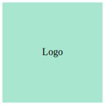

# Template for a Python Library



[](https://github.com/habedi/template-python-library/actions/workflows/tests.yml)
[](https://codecov.io/gh/habedi/template-python-library)
[](https://www.codefactor.io/repository/github/habedi/template-python-library)
[](https://pypi.org/project/template-python-library-placeholder/)
[](https://pypi.org/project/template-python-library-placeholder/)
[](https://github.com/habedi/template-python-library)
[](https://github.com/habedi/template-python-library/blob/main/docs)
[](https://github.com/habedi/template-python-library/blob/main/LICENSE)

This repository is a template to make the development of Python libraries easier.
It includes a basic structure, dummy package, unit tests, and GitHub Actions workflows for testing and deployment.
I am sharing this template in case others find it useful.

## Features

- **Poetry**: for dependency and virtual environment management.
- **Makefile**: for managing common tasks like testing, linting, and formatting.
- **GitHub Actions**: for running tests, linting, and deploying to PyPI.
- **Badges**: for showing the status of tests, code quality, version, etc.

## Structure

- `.github`: GitHub Actions workflows.
- `assets`: Asset files (e.g., images, logos, etc.).
- `docs`: Documentation for the library.
- `src`: Library's source code.
- `tests`: Unit tests.
- `.editorconfig`: Editor settings for consistent coding style.
- `.gitignore`: Excludes files generated by Python and Poetry.
- `.gitattributes`: Git LFS configuration.
- `LICENSE`: License file.
- `Makefile`: Manage tasks like testing, linting, and formatting.
- `pyproject.toml`: Poetry's configuration file.

## Getting Started

### Prerequisites

- `Python` >= 3.10
- `Poetry` (should work with `uv` as well)
- `GNU Make`

> [!NOTE]
> Tested on `Ubuntu 24.04 LTS` and `Debian 12`. But the template should work on other operating systems as well.
> You also need to have GNU Make installed on your system if you want to use the `Makefile`.

### Setting Things Up

1. **Clone the repository**:
    ```sh
    git clone https://github.com/habedi/template-python-library.git
    cd template-python-library
    ```

2. **Install dependencies**:
    ```sh
    make setup
    make install
    ```

### Development Workflow Management

```sh
# See the help for available commands
make help
```

```sh
# Run the unit tests
make test
```

```sh
# Lint the code
make lint
```

```sh
# Format the code
make format
```

```sh
# Perform type checking
make typecheck
```

```sh
# Build the library
make build
```

```sh
# Publish the library to PyPI
make publish
```

> [!NOTE]
> To publish the library to PyPI, make sure you have a PyPI account and a valid API token.
> Set the `PYPI_API_TOKEN` secret in your GitHub repository settings, and `PYPI_TOKEN` environment variable in your
> local environment.
> For more information, refer to the [Poetry documentation](https://python-poetry.org/docs/repositories/)
> and [GitHub documentation](https://docs.github.com/en/actions/reference/encrypted-secrets).

